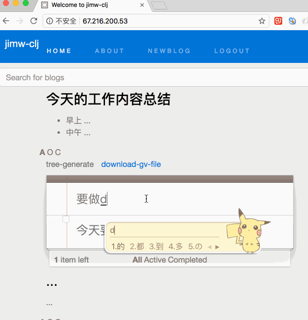

# jimw-clj: 结合机器学习做的带todos的博客, 用机器学习来机器学习 => `元学习`
* Power by Clojure/ClojureScript, Reagent
* 操作演示,就像聊天一样生成Lisp树

以上操作,生成如下的节点树


## Prerequisites

You will need [Leiningen][1] 2.0 or above installed.

[1]: https://github.com/technomancy/leiningen

## Running

To start a web server for the application, run:
```bash
    lein run
```
To start cljs dev compile
```bash
    lein figwheel
```
cljs product js compile
```bash
➜  jimw-clj git:(master) lein with-profile +uberjar cljsbuild once min
Compiling ClojureScript...
Compiling "target/cljsbuild/public/js/app.js" from ["src/cljc" "src/cljs" "env/prod/cljs"]...
Successfully compiled "target/cljsbuild/public/js/app.js" in 22.094 seconds.
➜  jimw-clj git:(master) ✗
``` 
## 已完成Todos
* 滑动分页 (支持手机和电脑滑动分页) √
* 排序是按照updated_at的时间来排序 (不方便cljs排序改成了按照id来排序) √
* 支持编辑文章,直接通过编辑文章列表的方式,可以预览markdown,支持手机友好编辑文章(直接双击就是编辑文章,标题和内容的编辑是分开的,离开on-blur就是保存,看到markdown的显示) √
* 每一篇文章'评论'都可以创建jimw树,把jimw和todos-tree整合得很好,可以作为todos类型的文章使用,方便复杂脑图分析(支持树干树枝评论生成树形) √
* 深度学习的学习目录todos,就像这个readme一样完成之后打钩,再看看列表就成就满满 ①  √
* 导出tree.gv文件给GraphViz看 √
* 多行输入textarea 手动，自动换行问题 √
* 登陆系统参考护理项目和clojure-web-admin (采用jwt的API验证) √
* db连接没有db的连接池5个,所以每次curd第一次都很慢 ①  (hikari-cp) √
* todos.cljs分开一个单页面来做,不然一个页面太多的atom不好控制了 => 一个atom放两级的数据,第一层是blog,第一层是todos,如果todos有内容就请求显示出来,可以在一个树上去更新两者 (采用一个atom放两级的数据,页面分开放的方法ok) √
* 为了API和单页面都可以方便使用,用jwt通用的加密方案加密API,登录成功就获取token √
* 多条件reduce搜索 √

## 未完成Todos
* 已经完成英文的标签云√
* 当前文章的标签云,最近一段时间的标签云(用pg_jieba分词)①  
* 连接微信爬虫,每天的消息,自动提取兴趣点, 用旧的华为手机作为微信爬虫(R,Clojure,Haskell),提取兴趣点来通知消息给jimw-clj
* 连接'网页语音阅读'APP,把语音成jimw树,文章可以选择创作
* 复习前端css,不仅实用,而且要漂亮,有创作的兴趣
* 结合更多的机器学习算法来提高文章的质量,关联规则,文章自动分类等,把机器学习算法用出去到现实生活当中
* cljs图形化使得更MMA化,甚至能摆脱Google的使用
* 每天的文章的协同过滤推荐: 根据最近30天的搜索的记录,和change-log来生成协同过滤推荐
* 点击文章段落的标注,可以任意位置插入标注文本,和'网页语音阅读'一样的效果, 或者选中一句话进行标注
* 加入文章的语义网络,就像Dracket一样查看源码函数变量,显示引用
* 就像jim-emacs-fun-r-lisp的功能λ目录一样做jimw-clj功能列表
* 单个文件(单篇文章)=>独立出去文件(独立出去完整的文章)
* 搜索词记录到一张表里面,方便做文章和todos推荐 ①
* Markdown的图片上传功能,用阿里云或者直接上传服务器 ①
* 和Clojure编写的APP,收集的数据用于训练jimw-clj的习惯: '网页语音阅读'阅读网页资料 + ocr 阅读书本拍照资料等等
* 方便学习推导递归算法 => tree的算法递归的实现方式是自我推导出来的二叉树算法: <算法新解>普通算法用出去影响整个生活,更新到fp-book里面
* 用选中的文章部分文字来创建todos: 就像有道词典一样`指词即译模式（按下Ctrl键指词）`, 就创建一个todos => `var selectionObj = window.getSelection(); selectionObj.toString() `
* 就像clojure-china一样,选中引用回复: 导入'网页语音标记阅读',用token访问jimw-clj的API,导入标记todos
* ClojureScript写Chrome的插件像Gooreplacer一样,帮助jimw-clj编辑: chrome-extension://jnlkjeecojckkigmchmfoigphmgkgbip/option/index.html => 写一个有道词典的cljs版本 ①
* 通过Chrome的插件调用本地的语言识别和OCR文字识别的服务
* 修改一下后端,id是updated_at的uinx时间id: 把update变成unix时间,就可以按照update的id来排序了===>> 书放在最上面的思想(默认的排序), 也提供选择排序按照创建的id(找附近创建的搜索思想) ① 可以支持两种排序方式, 按照id和updated_at的unix的数字大小排序
* 用上你所有的血与泪: 增加hichats显示,统计各个blog和todos的修改次数和增加次数
* 手机和jimw-clj流量统计
* 日志统计
* 无限滑动加载,而dom太多了,就会导致太卡了: dom 不能太多,渲染就会卡===>> 滚动加载要改成div置换就不会卡了,就像https://mobile.twitter.com/home一样,dom的数量一直保持某个数量不变,而js对象再多都没有问题,滑动的时候,js对象置换固定的dom元素

## 以实现一个优秀研究为工具目的: 量子力学研究工具诞生了MMA => 机器学习算法(.e.g:维特比算法)学习工具诞生了JIMW
* 数据流的λ化, 其他语言实现的算法的λ 化
* 数据流流向, 算法GIF演示
* 自然语言的学习能力和处理能力: 英语的学习能力, 语义网络的自动构建自动标记和学习
* 支持英文每日总结写作
* 支持英文精彩文章标注学习

## his_search_pro_code 分支: 导入安卓反编译的代码或者新的项目的代码,做搜索分析
* 每个文件都是一篇文章 -> 每个函数都是一篇文章
* jimw-clj的代码语义搜索 ①  (语义网未实现meta主谓宾) 
* 代码语义搜索,结构搜索,释放Lisp强大的原力(参考王垠的ydiff项目,如何写一个解释器,bbatsov/rubocop)
* Git Diff导入变成,ydiff结构化对比: 用机器学习算法来 帮助学习 超大规模  代码, 用机器学习算法来 重新 看待 原来的 东西 ==>> 对比jim0,jim1,jim2,jim3的结构演变,建立一个Git然后每次jim修改jim+n,都commit一次,自动生成结构对比搜索
* 方便Markdown的todo和todo列表转换,todo做好了,可以导入成md文章(md的todo文章,可以转为todo列表,打钩编辑单条等): `*`标签的文章,批量导入到todos的功能,以及把todos只有一级的导出到`*`标签的文章
* 所有的事件操作都有操作异步记录, 以便做`数据可视化`,树形网络,曲线,地图等等, 自我数据分析分析为元,自画像为中线打机器学习
* 搜索下拉推荐提示,自动补全提示
* 多个项目的代码可以并存, blog加一个类别字段
* 多关键词搜索时,搜索博客结果的关键词会全部高亮
* 多关键词搜索时,显示下拉列表,显示关键的当前行
* 关键词搜索结果,相关系数越高的,排越前面
* 提交的`git log`数据分析
* 手机上的语音标记todo,可以上传GPS,陀螺仪等等传感器数据到jimw-clj的API分析
* 练拳的照片和录音,还有运动记录,在线更新到jimw-clj上分析
* PRML演算jim-1234*展示递进过程,错误回归过程工具: 沿着兴趣的中线写算法,jimw-clj为腰,不要压力去写算法
* 算法编写帮助工具,好的填充数据,数据设定和轮廓展示: 用数据分析的思维去写算法,设定样本和预测结果,写算法模型
* 拖拽功能无限扩展,任何元素加上了draggable都可以拖动: 两个或者多个todo的互相拖拽,实现不同todo树之间的嫁接① ① 

## 代码语义结构搜索引擎
* 加一个专门的搜索列表,像Google搜索一样,可以复杂条件搜索代码的列表=>代码语义搜索列表
* 搜索的列表显示, 关键词出现的那一行代码, 如果两个关键词出现在同一行,那么只是显示一行,然后...显示下一个关键词出现那行的代码
* 相似代码的搜索,通过标签云,出现频率相似度 => 用机器学习来机器学习 => `元学习`
* 导入的Clojure代码,结尾不能有注释";"或者是";;"

## 借力打力
* 借助了太阳的引力才能甩出太阳系: 用re-frame来新构造jimw-clj的cljs系统
* 有子评论过的todo 或者 done后的 元素, 在使用拖拽时, 样式就错了
* 做一个像Chrome一样的广义的审查元素, 通过前端视图来模式匹配，对应的后端代码是在哪里的 => 2017 CLJS将要驾驭机器学习来打败业务系统
* 用CLJS直接画GV的树形的图, 加上事件流处理, 做数据分析
* 业务代码的数据流分析和可视化数据流, Dataframe的对应关系 ` a + b => c ` , 可视化项目树形数据流
* 批处理 + 特别处理 = 统计学方法修改某某数据流经过的代码, 批处理得越多, 说明统计运筹学运用得好, 反正是每一个繁琐无味数据型代码都特别改一遍
* 功夫图的自动生成的能力, 通过安卓的notebook笔记的描述，来自动画图, 深度学习自然语言转换为肢体图形语言
* 加快博客搜索速度: 添加一个blog表的数据冗余,如果false,就不需要todos的子查询了
* 向下滑,分页的loading图
* 整体的字体都要调小一点,手机上的notepad那么大的字体 √ 
* 写一个HTML转Markdown的功能
* 分页无限加载用Twitter的方式,无限价值,Cljs的对象可以无限多,但是dom元素越多就会越卡住了
* 支持多个Clojure代码算法库的学习=>支持其他的语言
* 算法GIF图和统计学图 => `gganimate:构建R语言可视化gif动图`在线版本
* 微信聊天记录的爬虫自动生成todos树: 解决很多好的想法和文采的句子都产生于聊天的过程, 如何将自己的消除浮在大数据流之上，"自动驾驶"呢? 
* 微信聊天记录自动生成,聊天语句提醒,自动回归核心的问题和想法初衷,这样的话, jimwclj就连接了整个世界了

## jimw-clj的特征工程: 你能想得到的都写下来
* 对于kmeans聚类来说: 一个todos有多少个可用特征(所在的层数,修改的次数,和文章标签云的相关系数,创建时间,修改最后时间,创建时间,上下连接节点数量)
* 用协同过滤来推荐相关的文章列表,像亚马逊的商品推荐一样
* 搜索推荐,根据搜索的历史来判断你想搜索的东西
* 贝叶斯文章分类,训练数据(训练的向量)
* todos的自动分类聚类: 1,2,3
* 预测某一类的文章的阅读量,预测某一类的文章某一段时间的创造数量
* 统计机器学习: 你想要预测什么? 就决定了你需要什么模型, 需要你要的训练数据的样子

## Sqldot的不足,我只是看到了Tesla的不足
* 搜索中文的时候,关系搜索不出来,只有搜索准确多关键词英文时,才可以搜索结果出来
* 无法错误英文纠正搜索 => 易① :可以在中文搜索结果中,找到英文的对应,再用英文搜索,就可以搜索出来了,因为关系对应没有做中文的注释或者翻译

## 当你有气无力的时候,你可以文学编程或者只是录音切割识别
* 录音切割识别整合到jimwclj上面
* 不管是什么天马行空的想法全部都转为文本,慢慢排序选择有趣的来做,至少今天是有意思的一天
* 买个iPhone手机

* 导入Clojure伟大项目代码分析搜索: ` (read-string-for-pro (fn [code-list file-name] (map first code-list)) "leiningen") ` 
* defenum每新加一个项目,都加一个enum给它

## 添加待机语音输入控制搜索,以及语音反馈: 把jimwclj作为一个背后厉害的朋友, 语音反馈网络
* 自动语音切割 ①
* 自我设计语音识别引擎, 深度学习GPU, 自我十个小时以上的语音标注训练: 需购买一台`GTX1080 TI`的主机

## jimw-clj的把通用的纯函数独立出去,变成库
* 先作为不同的文件,然后再作为纯函数组合模块独立出去
* 清空自己的思想,每天push不同的repository

## 顺着中线兴趣而下,Lisp原力释放可以发挥到极致
* 不要在项目瓶子里编程,而是在repl中自由的翱翔
* 中文搜索sqldot,做成英文的搜索下拉提示,on-change input的时候,就去map->en,look v3 => 最简单粗暴的方法,实现Lisp高速大脑流: 先简单做一个atom,直接显示li列表就行,点击填入到输入框,input的change都会修改这个atom

## 如何快速开发一个新的未知的功能? 不能支持多次代码搜索递进,直到成功测试: 项目代码搜索到代码构建
* 完成re-frame某某功能
* 完成websocket某某功能
* repl执行S数据及结果, log的分析
* 项目例子的某一个功能的极简部分自动提取
* 预测版本+搜索S数据 和 实际版本: 机器学习就像代码调研一样,特征数据挖掘, 减少实际的样子和你预测的样子的差距
* 需要一个jim0,jim1,jim2,jim3...jimN的一个过程注意力板: 每一个版尽量是成功的,也可以允许是错误的+你想要的特性,如: ==>> 特别适合功能特性演进和回归, 算法的演算组合
```clojure
;; jim0 只是创建一个Socket,什么都不干,只能连接它
(import [java.net ServerSocket])
(ServerSocket. 3000 0 nil)
;; jim1 尝试实时通讯
(...)
...
;; jimN 可以自由表达通讯
(...)
```
* 分开后保存的S表达式,可以重新组合成S文件: 简单粗暴的办法就是再保存一次S文件到jimdb,可以跳转到该文件查看,类型分别问文件类型和S表达式类型
* 登录过期后,websocket提醒
* 电脑端jimw-clj和手机jimw-clj和网页语音标记阅读APP,文章或者todo修改了增加了都互相同步: 他们都订阅了文章或者todo的消息 ==>> 就像网页微信,电脑微信,手机微信的消息同步一样
* jimw-clj和wechat4u的网页微信的消息同步① , 流式数据分析

## Websocket视频流化CLJS应用: CLJS图形驱动流的最高境界
* Websocket视频聊天jimw-clj,比HTTP快多了,而且不用三次握手,直接byte,不用base64
* Github关注的人的事件提醒数据流处理,用Kafka数据流
* Jimwclj的微信扫码登录: Websocket
* 最先支持Java和JS代码搜索,也可以Ruby代码搜索: 多维度的学习, Java和JS的资源最多 => 面向对象没有函数式那么好切割代码,参照目标语言编译器或者解释器部分,是如何解析的
* 目标语言的机器学习切割: 需要一定的语法规则训练,需要一些source-map的规则,对应回原来的文件的地方,就像CoffeeScript一样
* 就像HMM给汉语分词标注词性一样,不同的词性的切割方式是不一样的: 汉语的分词词性标注=>代码分割

# 如何运用Github和Google来机器学习训练jimwclj代码搜索分析能力？
## Github的搜索结果的导入到jimw-clj:   特征向量化: 相关的全部列出来到一个清单,然后jimw-clj把这些token化,找到中线的关键词是哪些 => 向量化预测: 然后用这些中线的关键词特征向量,找到目标项目背后的源代码的位置和上下文,提供给Emacs自动提示
* 比如Github搜索`GQL_CONNECTION_INIT`很多的示例代码, 把GQL_CONNECTION_INIT相关的上下文全部提取出来
* Issue某个AAA问题回答BBB是正确的,那么就可以用BBB训练AAA问题
* 工程和ML的高度融合,无处不在ML: 做一个jimwclj网页的WebSocket的repl,就像ruby的byebug一样,可以网页repl,把所有的repl记录做分析
* 每天的Google浏览和搜索的数据分析: Chrome插件,油猴李志
* 是上下关系还是平行关系===>> 代码搜索的最重要的指标之一 ===>> 贝叶斯分类,两种分类
* 代码的对比修改很重要
* 就像物理学家做实验一样,统计不同因素多次实验和多次相同实验取平均值: 机器学习就是要机器发现海量数据流中的自我价值规律,统计数学家的数学实验

## 以PG数据流改变为核心的流式分析
* Async(像Kafka一样强大)订阅给数据分析应用和数据采集应用等
* 统计手机事件: 统计每次玩手机的时间长度,流量分析

* read-string非法规则的机器学习: 提取已经导入成功的代码的特征,过滤掉报错的read-string特征,最后剩下非法的read-string特征
* 统计学思维: 统一收集错误,统一解决, 如果Clojure无法catch住的错误,那么把列表交给上一层的Shell去处理统计
* 语言AST分解法则: 函数的定义和其他分开就可以了
* 任何语言都在数据库中都只是保存AST或者S表达式,以便进一步做结构化的搜索,但是显示出来的语言原来的语法
* 支持MMA和Elisp语言分解搜索
* 导入ydiff的racket代码,以及fp-book的scheme代码,做代码搜索,导入racket官方的代码,scheme官方的代码

## 代码语义搜索主要设计: 基于ydiff的通用解析来做,进行扩展
* ydiff的S通用: C++也可以S对比
* 人可以通过实例来学习代码库,机器学习也可以: 通过实例或者文档wiki来机器学习,代码向量,通过实例的算法机器学习,来搜索识别隐藏在海量代码中的算法应用
* PRML机器学习的意义在于模式识别,算法也是一种模式: https://github.com/chanshunli/fp-book/tree/master/algorithms将算法新解融入机器学习当中来
* 参考里面的python的S表达式提取,转给postwalk去瘦身: https://github.com/racket-china/psydiff

* 添加一张表监听Chrome的收藏文章,Websocket同步到"网页语音标记阅读"APP里面: 听王垠的文章
* 加入搜索tag补全: `幽默六病` & 代码项目tag
* 导入大规模的C代码搜索: 像Linux内核一样的代码=>重写一个Linux
* 把postwalk做成一个结构搜索: 搜索define结构, **复合算法结构  ①  ①
* 在代码结构搜索的基础上实现: 流式的代码修改就像流式的数据管道修改一样容易,即简单的修改不可变数据沿路的纯函数都跟着数据改变而改变=>最小力气修改重复代码工作

## ① jimw-clj开始无限连接安卓了
* Websocket同步多个应用和多个设备,不用刷新了①
* 太多任务了,自动排序简单和有趣和影响力大的①
* 导入readme的todo到分布式的todo里面: 用更新todos来更新jimw-clj目录①
* 复杂算法就像his_graph.dot的组合一样,复杂算法的自动搜索分解也是这样的①, 只是关注每一个联系层面的算法(一个维度),其他的不显示就好了(其他的维度)
* 专门做一个Websocket页面来实时更新全屏展示GraphViz: 就像GraphViz.app一样,然后可以展示各个todo进度,还有做决策树训练 ① 
* 好的艺术家窃取想法,差的艺术家抄袭作品: 以tree-fn-new函数为核心,连接S代码分开保存的上下节点,递归连接可展现整个程序,就像ydiff一样有数字标记树中的位置,可以做代码更改jim0,jim1的对比等 ==>> 分开来才可以方便加各种维度特征进去,做代码语义搜索机器学习①
* jim-emacs-fun-r-lisp/todos-apriori.R特征提取问题: todos任务关联规则, todo分词之后需要制定一个' 东西'类别或者一个名词'洗澡,洗衣服'等,提高关联规则识别率, 最简单粗暴的方法可以提取todo的名词作为一个todoitem ①
* 一个分布式todo代码的commit系统: jimw-clj和jim-emacs-fun-r-lisp同时commit
* com.huaban/jieba-analysis不支持词性标注,只能采用Hanlp或者第一版jieba(C++和Python) => hanlp太消耗内存了(1G会OutOfMemoryError) , 线上使用`bin/jieba.py`可以低内存运行
* 增强todos相互之间的引用能力: 就像库环境一样,快速开发新的todo, 增加todo的多维度数据

## 用postwalk搜索来做一个算法新解的算法搜索应用的应用,推出去到开源给大家用,然后再做一个广义的算法搜索工具,用于机器学习和深度学习的算法中去,利于大部分人随时随地学习算法 ①
* 个人的学习能力和公司和学校是无关的,就像好的学校照样出来学渣一样: 无限的运用自身和身边的资源的创造力,把自己的能力网络和世界联通起来
* 以List作为核心的数据类型,算法只是不同的List数据组合而已,就像业务的数据表关系Viz一样,只是展示了其中一种组合的业务模式
* A算法分解成独立的List小块,通过一定的结构搜索,可以把A算法重新组合起来: 以组合搜索为核心
* 不管是枯燥的还是不喜欢的,一切皆是桥,来度化你的: 脱离了世界的网络,一个人反而很难建立起来真正实用的jimw-clj来, 需要挑战思考时快速λ演算,没有什么思路时就完成一些不用脑子的任务或者事情

* Google搜索`clojure regex match mutil line` => 自动更正拼写和语义: ` clojure regex match multiline ` ① jimwclj的搜索自动更正拼写和语义 ==>> `Fixed search:regex match mutil line start end => Match inclusive between start and end over multiple lines`
* 用EmacsLisp和read-string写一个工具遍历检查每个list的错误非常字符 ① ①
* 对于不支持AST的语言的通用解决办法: 用Elisp主编辑模式脚本或者简单粗暴的办法正则表达式分解语言的每一部分
* AST支持的语言,实现定义跳转,通过AST的静态分析
* 用clojure的instaparse,而不是用lex/yacc(CoffeeScript就是用yacc写的语法解析器)来解析任意语言: 来分解MATLAB的代码 ① ① ===>> instaparse建立在良好的正则表达式基础上和SICP元解释器基础上
## License

Copyright © 2017 FIXME
